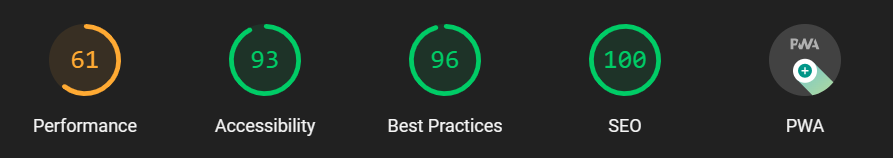

# Juan Diaz's Documentation Site

This is my documentation site, I will be using this site to document my learning process and to share my knowledge with others.


### Lighthouse Score 🚀



## What I Did to Run This Documentation Site Using Jekyll (Step by Step)

First some context, Jekyll is a static site generator that transforms your plain text into beautiful static web sites and blogs. It can be use for a documentation site, a blog, an event site, or really any web site you like. It’s fast, secure, easy, and open source. It’s also the same site generator I use to maintain my open source documentation.

---

I watched a [Youtube](https://www.youtube.com/watch?v=F8iOU1ci19Q) video created By Techno Tim and follow alone their [documentation](https://docs.technotim.live/posts/jekyll-docs-site/).

### 1. Install Prerequisites:

[Installing Ruby and Jekyll for windows](https://jekyllrb.com/docs/installation/windows/)

> The Installation was via RubyInstaller by using the RubyInstaller for Windows. (follow those 4 steps, I needed to [download](https://rubyinstaller.org/downloads/) the RubyInstaller .exe file.)

Note: I tried to installed from Bash but it failed. (I opened the github folder in local and tried the installation via Bash on Windows 10).

- I used the [Jekyll](https://github.com/jekyll/jekyll) repository on Github.
- I also used the [jekyll-theme-chirpy](https://github.com/cotes2020/jekyll-theme-chirpy) to create my own documentation site.

### 2. Creating a New Site

4. I follow the [Getting Started](https://chirpy.cotes.page/posts/getting-started/) steps - Using the Chirpy Starter (template).

- Sign in to GitHub and browse to Chirpy Starter.
- Click the button Use this template > Create a new repository, and name the new repository.
- Then Copy the new repo and clone it on my local computer.

### 3. Installing Dependencies

- Open terminal from that repo and install dependencies.
- Follow the wiki doc on jekyll-theme-chirpy.

## Jekyll Commands

- Install dependencies by running the following command.

  ```console
  bundle
  ```

- **To run the project as localhost after completing everything** (serving your site)

  ```console
  bundle exec jekyll s
  ```

- **To Run the Site locally with drafts and livereload**

  ```console
  bundle exec jekyll s --livereload --drafts
  ```

<!-- shorter for...   bundle exec jekyll server -->

### Summary

> 💡 Remember to install Jekyll, then install the dependences, copy the theme, rename and modify it.

### Usage

Please see the [theme's docs](https://github.com/cotes2020/jekyll-theme-chirpy#documentation).

### License

This work is published under [MIT][mit] License.

[gem]: https://rubygems.org/gems/jekyll-theme-chirpy
[chirpy]: https://github.com/cotes2020/jekyll-theme-chirpy/
[use-template]: https://github.com/cotes2020/chirpy-starter/generate
[CD]: https://en.wikipedia.org/wiki/Continuous_deployment
[mit]: https://github.com/cotes2020/chirpy-starter/blob/master/LICENSE
