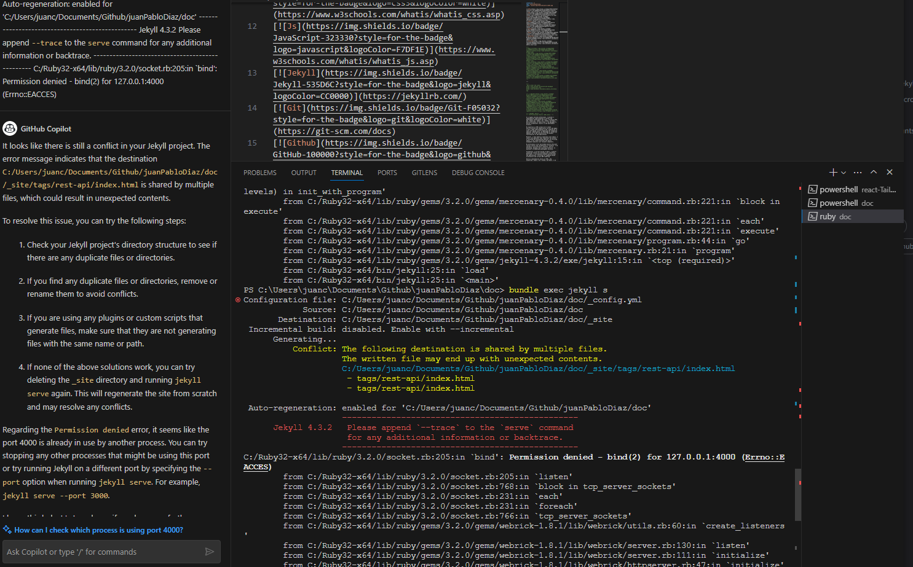
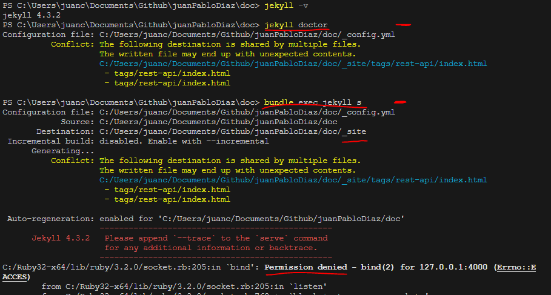

Now that I have this documentation site up and running (which I did a couple months ago using Jekyll).
I am not sure how to I run the site with Jekyll in local and make some changes...

> 💡 Make sure that I have all the Prerequisites install on the machine. If not, check the previos post [How To Create Static Site Generator with Jekyll](https://www.docs.jpdiaz.dev/posts/create-site-jekyll/)

## Run the Jekyll Commands to:

### Install Dependencies

```bash
bundle
```

Or

```bash
bundle install
```

### Run as Local

**To run the project as localhost after completing everything** (serving your site)

```bash
bundle exec jekyll s
```

Small for `bundle exec jekyll serve`

Or

```bash
bundle exec jekyll s --port 3000
```

In case `Port 4000` is already in use.

### Run as Local with Auto-Reload

**To run the project as localhost and reload the site** (serving your site)

```bash
bundle exec jekyll s --livereload
```

### Run the Site with Drafts

Command use to run the project and be able to see the draft posts which are stored in the `_drafts` folder.

```bash
jekyll server --drafts
```

Or

```bash
bundle exec jekyll s --livereload --drafts
```

Using the `Live Reload` option will reload the browser.

## Errors:

### Permission denied error:

Regarding the Permission denied error, it seems like the port 4000 is already in use by another process. You can try stopping any other processes that might be using this port or try running Jekyll on a different port by specifying the --port option when running jekyll serve. For example, jekyll serve --port 3000.

```bash
bundle exec jekyll s --livereload --drafts --port 3000
```



Helpfull Commands

- `jekyll -v` to ensure you have installed Jekyll and its dependencies correctly.
- `bundle install` to check for dependencies.
- `jekyll doctor` to check for syntax errors.
  the error comes up after running `jekyll doctor`:
  
