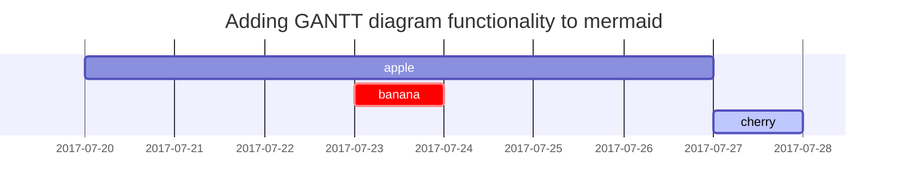

<!--  -->

## Text and Typography

This post is intended to demonstrate Markdown syntax rendering on [**Chirpy**](https://github.com/cotes2020/jekyll-theme-chirpy/fork), You can also utilize it as a writing example. Now, let's begin exploring text and typography.

This documentation article has been sourced from [**Chirpy Doc**](https://chirpy.cotes.page/posts/text-and-typography/).

## Headings

<h1 class="mt-5">H1 - heading</h1>

<h2 data-toc-skip>H2 - heading</h2>

<h3 data-toc-skip>H3 - heading</h3>

<h4>H4 - heading</h4>

## Paragraph

Generating random paragraphs can be an excellent way for writers to get their creative flow going at the beginning of the day. The writer has no idea what topic the random paragraph will be about when it appears. This forces the writer to use creativity to complete one of three common writing challenges. The writer can use the paragraph as the first one of a short story and build upon it. A second option is to use the random paragraph somewhere in a short story they create. The third option is to have the random paragraph be the ending paragraph in a short story. No matter which of these challenges is undertaken, the writer is forced to use creativity to incorporate the paragraph into their writing.

## Lists

### Ordered list

1. Firstly
2. Secondly
3. Thirdly

### Unordered list

- Chapter
  - Section
    - Paragraph

### ToDo list

- [ ] Job
  - [x] Step 1
  - [x] Step 2
  - [ ] Step 3

### Description list

Sun
: the star around which the earth orbits

Moon
: the natural satellite of the earth, visible by reflected light from the sun

## Block Quote

> This line shows the _block quote_.

## Prompts

> An example showing the `tip` type prompt.
> {: .prompt-tip }

> An example showing the `info` type prompt.
> {: .prompt-info }

> An example showing the `warning` type prompt.
> {: .prompt-warning }

> An example showing the `danger` type prompt.
> {: .prompt-danger }

## Tables

| Company | Contact          | Country |
| :------ | :--------------- | ------: |
| Tesla   | Maria Anders     | Germany |
| Apple   | Helen Bennett    |      UK |
| Rolex   | Giovanni Rovelli |   Italy |

## Links

<http://127.0.0.1:4000>

## Footnote

Click the hook will locate the footnote[^footnote], and here is another footnote[^fn-nth-2].

## Inline code

This is an example of `Inline Code`.

## Filepath

Here is the `/path/to/the/file.extend`{: .filepath}.

## Code blocks

### Common

```
This is a common code snippet, without syntax highlight and line number.
```

### Specific Language

```bash
if [ $? -ne 0 ]; then
  echo "The command was not successful.";
  #do the needful / exit
fi;
```

### Specific filename

```sass
@import
  "colors/light-typography",
  "colors/dark-typography";
```

{: file='\_sass/jekyll-theme-chirpy.scss'}

## Mathematics

The mathematics powered by [**MathJax**](https://www.mathjax.org/):

$$ \sum\_{n=1}^\infty 1/n^2 = \frac{\pi^2}{6} $$

When $a \ne 0$, there are two solutions to $ax^2 + bx + c = 0$ and they are

$$ x = {-b \pm \sqrt{b^2-4ac} \over 2a} $$

## Mermaid SVG



## Add Images

### Default (with caption)

{: width="972" height="589" }
_Full screen width and center alignment_

### Left aligned

{: width="972" height="589" .w-75 .normal}

### Float to left

{: width="972" height="589" .w-50 .left}
Praesent maximus aliquam sapien. Sed vel neque in dolor pulvinar auctor. Maecenas pharetra, sem sit amet interdum posuere, tellus lacus eleifend magna, ac lobortis felis ipsum id sapien. Proin ornare rutrum metus, ac convallis diam volutpat sit amet. Phasellus volutpat, elit sit amet tincidunt mollis, felis mi scelerisque mauris, ut facilisis leo magna accumsan sapien. In rutrum vehicula nisl eget tempor. Nullam maximus ullamcorper libero non maximus. Integer ultricies velit id convallis varius. Praesent eu nisl eu urna finibus ultrices id nec ex. Mauris ac mattis quam. Fusce aliquam est nec sapien bibendum, vitae malesuada ligula condimentum.

### Float to right

{: width="972" height="589" .w-50 .right}
Praesent maximus aliquam sapien. Sed vel neque in dolor pulvinar auctor. Maecenas pharetra, sem sit amet interdum posuere, tellus lacus eleifend magna, ac lobortis felis ipsum id sapien. Proin ornare rutrum metus, ac convallis diam volutpat sit amet. Phasellus volutpat, elit sit amet tincidunt mollis, felis mi scelerisque mauris, ut facilisis leo magna accumsan sapien. In rutrum vehicula nisl eget tempor. Nullam maximus ullamcorper libero non maximus. Integer ultricies velit id convallis varius. Praesent eu nisl eu urna finibus ultrices id nec ex. Mauris ac mattis quam. Fusce aliquam est nec sapien bibendum, vitae malesuada ligula condimentum.

### Dark/Light mode & Shadow

The image below will toggle dark/light mode based on theme preference, notice it has shadows.

{: .light .w-75 .shadow .rounded-10 w='1212' h='668' }
{: .dark .w-75 .shadow .rounded-10 w='1212' h='668' }

## Video

Adding a youtube video is super easy, just copy the code and modify the id.



## Add Featured Images to Jekyll Posts

Have you ever desired to incorporate a graphic at the beginning of your Jekyll post but lacked the knowledge on how to accomplish it? Fear not, for it is a simple task requiring only a small portion of code.


_watch the series_

> Remember to watch from minute 12. (usefull info before but its not for that)

### Code

Add to the layout of the blog page:

```markdown
---
image: /assets/img/banners-posts/default.jpg
---
```

Add to the begining of the blog page:

```markdown

```

## Reverse Footnote

[^footnote]: The footnote source
[^fn-nth-2]: The 2nd footnote source
